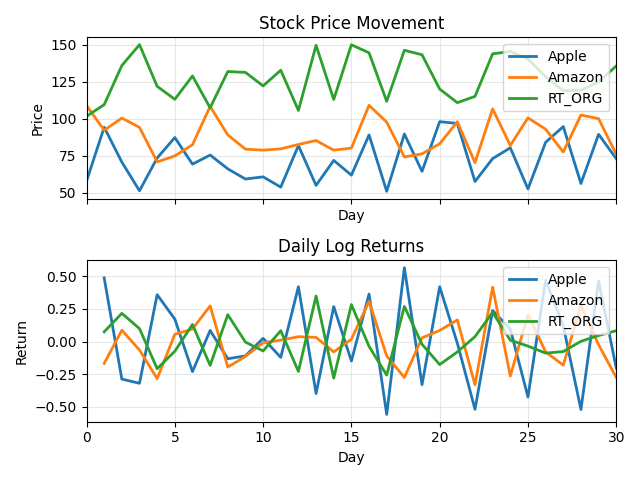

# Lab Project: Synthetic Stock Data Generator

This project creates synthetic stock price data for three sample stocks, writes the generated data to CSV files, calculates basic risk metrics, and plots both price movement and daily log returns.

## Overview

The main script is [get_data.py](get_data.py). When you run it, the script:

1. Creates 30 days of synthetic data for each stock.
2. Generates a random opening price for each day.
3. Derives the closing price for days 1 to 29 from the next day's opening price.
4. Generates a random closing price for day 30.
5. Calculates daily log returns with `ln(close / open)`.
6. Computes the standard deviation of those returns.
7. Scales that standard deviation to a 30-day volatility estimate.
8. Saves each stock table as a CSV file inside the `stock_prices/` folder.
9. Prints the metrics and a qualitative volatility label in the terminal.
10. Displays and saves a figure containing two Matplotlib charts.

## Dependencies

The script uses:

- `csv`: writes CSV output files
- `numpy`: generates random numbers and performs calculations
- `matplotlib`: draws the charts

Install the required packages with:

```bash
pip install -r requirements.txt
```

## Detailed Code Walkthrough: Step-by-Step Explanation

### **Step 1: Generating Prices Using NumPy (High & Low Range)**

```python
open_price = np.random.uniform(alt_low, alt_high, size=rows)
```

**What happens:**
- `np.random.uniform(alt_low, alt_high, size=rows)` generates **30 random numbers** between `alt_low` and `alt_high`
- Each random number represents the **opening price for one trading day**
- For Apple: `np.random.uniform(50, 100, size=30)` → generates 30 random prices between $50 and $100

**For closing prices:**

```python
close_price = np.empty(rows, dtype=float)      # Create empty array (30 slots)
close_price[:-1] = open_price[1:]              # Days 1-29: close = next day's open
close_price[-1] = np.random.uniform(alt_low, alt_high)  # Day 30: random close
```

**How it works:**
- `close_price[:-1]` = all elements except the last one (days 1-29)
- `open_price[1:]` = all opening prices shifted forward by 1 day (days 2-30's opens become days 1-29's closes)
- This creates a **linked price series** where today's close = tomorrow's open (realistic pattern)
- Day 30 gets a fresh random close price (not linked to day 31, which doesn't exist)

---

### **Step 2: Creating Function & Dictionary Format**

```python
def generate_stock(name: str, alt_high: int, alt_low: int):
    # ... calculations (prices, returns, volatility) ...
    
    return {"Name": name, "Data": arr, "Std_dev": std_dev, 
            "Volatility": volatility, "Prices": prices}
```

**Why dictionary format?** Easy data organization and access:

| Key | Value Type | Purpose | Example Access |
|-----|-----------|---------|-----------------|
| `"Name"` | string | Stock identifier | `stock1["Name"]` → "Apple" |
| `"Data"` | 30×4 array | Days, Open, Close, Returns | `stock1["Data"]` → full table |
| `"Std_dev"` | float | Daily volatility measure | `stock1["Std_dev"]` → 0.0089 |
| `"Volatility"` | float | 30-day scaled volatility | `stock1["Volatility"]` → 0.0487 |
| `"Prices"` | list (31 values) | For plotting price line | `stock1["Prices"]` → [price_day0, ...price_day30] |

---

### **Step 3: Getting 3 Stocks & Storing in Variables**

```python
stock1 = generate_stock("Apple", 100, 50)      # High=100, Low=50
stock2 = generate_stock("Amazon", 110, 70)     # High=110, Low=70
stock3 = generate_stock("RT_ORG", 150, 100)    # High=150, Low=100
```

**What happens:**
- Each `generate_stock()` call creates **one complete stock dictionary** with 30 days of data
- **stock1** contains Apple's synthetic data (prices between $50-$100)
- **stock2** contains Amazon's synthetic data (prices between $70-$110)
- **stock3** contains RT_ORG's synthetic data (prices between $100-$150)

**How to access the data:**
```python
stock1["Name"]           # "Apple"
stock1["Data"]           # 30×4 table with all prices and returns
stock1["Data"][5, 1]     # Row 5, Column 1 (6th day's opening price)
stock1["Volatility"]     # 0.0234 (example volatility value)
stock1["Prices"]         # List of 31 prices for plotting
```

---

### **Step 4: Put 3 Stocks in List & Iterate (Save in One Shot)**

```python
for i in [stock1, stock2, stock3]:  # Loop through all 3 stocks one by one
    with open(f"stock_prices/{i["Name"].lower()}.csv", 'w', newline="") as f:
        write = csv.writer(f)
        
        write.writerow(["Days", "Open", "Close", "Returns"])  # Write header row
        write.writerows(i["Data"])  # Write all 30 data rows
        print(f"Stock Price of {i["Name"]} saved to {i["Name"].lower()}.csv file")
```

**How it works:**

| Loop Iteration | Variable `i` | File Created | What Gets Saved |
|---|---|---|---|
| 1 | `stock1` | `apple.csv` | Apple's 30 days of data |
| 2 | `stock2` | `amazon.csv` | Amazon's 30 days of data |
| 3 | `stock3` | `rt_org.csv` | RT_ORG's 30 days of data |

**Key points:**
- `i["Name"].lower()` converts "Apple" → "apple" (lowercase filename)
- `write.writerow(["Days", "Open", "Close", "Returns"])` creates the CSV header
- `write.writerows(i["Data"])` writes all 30 rows at once (Data is a 30×4 array)
- **One loop saves all 3 CSV files automatically!**

---

### **Step 5: Getting Quantitative Data & Displaying**

```python
print("Stock:", i["Name"])
print(f"Standard Deviation:", i["Std_dev"])
print(f"Volatility:", i["Volatility"])
```

**Terminal output example:**
```
Stock: Apple
Standard Deviation: 0.0089
Volatility: 0.0487
Medium Volatility - normal trading range
```

**Volatility Classification (if-else logic):**

```python
if i["Volatility"] < 0.005:
    print("Very Low Volatility - stable / no movement")
elif i["Volatility"] < 0.015:
    print("Low Volatility - smooth trend")
elif i["Volatility"] < 0.03:
    print("Medium Volatility - normal trading range")
elif i["Volatility"] < 0.06:
    print("High Volatility - risky, large swings")
else:
    print("Extreme Volatility - highly unstable / speculative")
```

**What this does:**
- Compares each stock's volatility value against thresholds
- Assigns a **qualitative risk label** based on the computed volatility
- This happens **inside the loop**, so you get metrics for all 3 stocks

---

### **Step 6: Plotting Prices & Returns Data**

#### **Step 6a: Extract data arrays from dictionaries**

```python
days = np.arange(0, 31)              # Days 0 to 30 (31 points for price chart)
return_days = np.arange(1, 31)       # Days 1 to 30 (30 points for returns chart)

stock1_returns = stock1["Data"][:, 3]  # Extract ALL rows, Column 3 (Returns)
stock2_returns = stock2["Data"][:, 3]
stock3_returns = stock3["Data"][:, 3]
```

**How it works:**
- `stock1["Data"]` is a 30×4 table: [Days | Open | Close | Returns]
  - Column 0: Days
  - Column 1: Open prices
  - Column 2: Close prices
  - Column 3: Returns
- `[:, 3]` means "all rows, column index 3" (the Returns column only)
- Result: `stock1_returns` is a 1D array of 30 return values

#### **Step 6b: Create figure with 2 subplots**

```python
fig, axs = plt.subplots(2, 1, sharex=True)
# fig = the entire figure window
# axs = array containing 2 subplot objects
# (2, 1) = 2 rows, 1 column (stack plots vertically)
# sharex=True = both subplots share the same x-axis (days)
```

#### **Step 6c: Plot 1 - Stock Price Movement (Top Subplot)**

```python
axs[0].plot(days, stock1["Prices"], label=stock1["Name"], linewidth=2)
axs[0].plot(days, stock2["Prices"], label=stock2["Name"], linewidth=2)
axs[0].plot(days, stock3["Prices"], label=stock3["Name"], linewidth=2)

axs[0].set_title("Stock Price Movement")
axs[0].set_xlabel("Day")
axs[0].set_ylabel("Price")
axs[0].legend()           # Shows which line belongs to which stock
axs[0].grid(True, alpha=0.3)  # Add grid lines (alpha=0.3 makes them faint)
```

**What it does:**
- Plots 3 lines on the **top subplot** (axs[0])
- X-axis: days 0 to 30 (31 points total)
- Y-axis: stock prices
- Each stock gets a different colored line
- Legend identifies each line

#### **Step 6d: Plot 2 - Daily Log Returns (Bottom Subplot)**

```python
axs[1].plot(return_days, stock1_returns, label=stock1["Name"], linewidth=2)
axs[1].plot(return_days, stock2_returns, label=stock2["Name"], linewidth=2)
axs[1].plot(return_days, stock3_returns, label=stock3["Name"], linewidth=2)

axs[1].set_title("Daily Log Returns")
axs[1].set_xlabel("Day")
axs[1].set_ylabel("Return")
axs[1].legend()
axs[1].grid(True, alpha=0.3)
```

**What it does:**
- Plots 3 lines on the **bottom subplot** (axs[1])
- X-axis: days 1 to 30 (30 points - return data only, no day 0)
- Y-axis: daily log returns (positive = profit, negative = loss)
- Shows how much the price changed each day

#### **Step 6e: Save & Display**

```python
plt.tight_layout()              # Prevents subplot overlap
plt.savefig("figures/plots.png")  # Save figure as PNG file
plt.show()                      # Display figure in a window
```

---

### **Complete Execution Flow Summary**

```
┌─────────────────────────────────────────────────┐
│ 1. generate_stock() Function                     │
│    - Creates 30 days of synthetic data          │
│    - Calculates returns & volatility            │
│    - Returns dictionary                         │
└─────────────────┬───────────────────────────────┘
                  │
┌─────────────────▼───────────────────────────────┐
│ 2. Call Function 3 Times                        │
│    - stock1 = Apple (50-100)                    │
│    - stock2 = Amazon (70-110)                   │
│    - stock3 = RT_ORG (100-150)                  │
└─────────────────┬───────────────────────────────┘
                  │
┌─────────────────▼───────────────────────────────┐
│ 3. Loop & Save CSV Files                        │
│    - for i in [stock1, stock2, stock3]:         │
│    - Save apple.csv, amazon.csv, rt_org.csv    │
│    - Print metrics & volatility labels          │
└─────────────────┬───────────────────────────────┘
                  │
┌─────────────────▼───────────────────────────────┐
│ 4. Extract Data from Dictionaries               │
│    - Get stock1_returns, stock2_returns, etc.   │
│    - Create days arrays (0-30) & (1-30)        │
└─────────────────┬───────────────────────────────┘
                  │
┌─────────────────▼───────────────────────────────┐
│ 5. Create & Plot Figures                        │
│    - Top: Price movement (3 lines)              │
│    - Bottom: Daily returns (3 lines)            │
│    - Save to figures/plots.png                  │
└─────────────────┬───────────────────────────────┘
                  │
┌─────────────────▼───────────────────────────────┐
│ 6. Display Results                              │
│    - Show plots in Matplotlib window            │
└─────────────────────────────────────────────────┘
```

## How To Run

From the project folder, run:

```bash
python get_data.py
```

After execution:

- the CSV files are written to `stock_prices/`
- the figure is saved to `figures/plots.png`
- Matplotlib opens a window showing the two plots



## Notes

- The data is randomly generated each time you run the script, so the CSV values and plots will change on every execution.
- If you want repeatable results, add a NumPy random seed near the top of the script, for example `np.random.seed(42)`.
